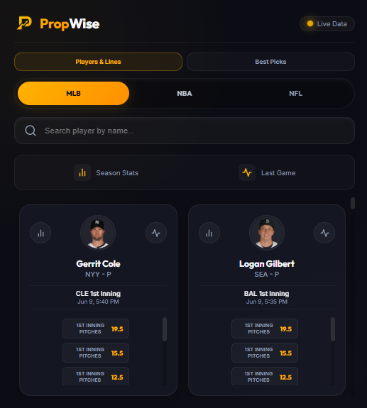
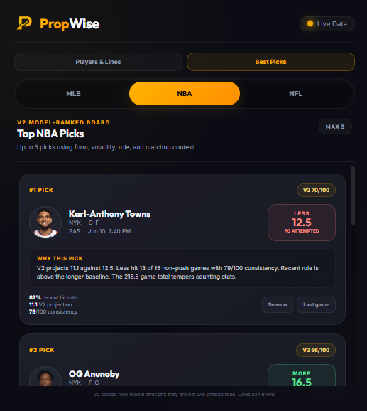
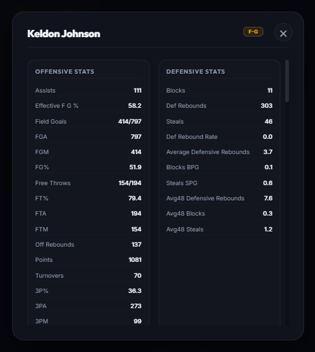

# PropWise

## Description
PropWise is a Chrome extension for researching NFL, MLB, and NBA player props. Browse live player lines, review season and recent-game performance, or use the V2 Best Picks view to find a focused shortlist of model-ranked opportunities.

## Features
- **Players & Lines** - Browse and search the full PrizePicks player board.
- **V2 Best Picks** - View up to five qualified picks for MLB, NBA, or NFL.
- **Clear Pick Analysis** - See the line, More/Less direction, V2 projection, consistency score, and explanation.
- **Sport-Specific Context** - V2 evaluates form, volatility, role, matchup conditions, and sample reliability.
- **Player Statistics** - Review season performance and last-game data without leaving the extension.
- **Multi-Sport Coverage** - Switch between MLB, NBA, and NFL from the same interface.

## Prerequisites
- Google Chrome browser

## Setup Instructions
1. **Install the Extension:**
   - Download and install the PropWise extension from the Chrome Web Store.

2. **Permissions:**
   - The extension requires access to the following hosts:
     - `https://api.prizepicks.com/*`
     - `https://statsapi.mlb.com/*`
     - `https://*.espn.com/*`

## Usage Instructions
1. **Open the Extension:**
   - Click on the PropWise icon in the Chrome toolbar to open the extension popup.

2. **Choose a View:**
   - Use Players & Lines for the full searchable board or Best Picks for the ranked shortlist.

3. **Choose a Sport:**
   - Open the MLB, NBA, or NFL tab.

4. **Review Players or Picks:**
   - Search the full player board, or compare each ranked pick's line, direction, projection, consistency, and explanation.

5. **View Last Game's Player Statistics:**
   - Click on the last game's stats icon to view detailed player statistics the last game played.

6. **View Advanced Season Stats:**
   - Click on the season stats icon to view detailed player statistics for the season.

## Screenshots

### Players & Lines

Search the complete player board, browse available lines, and open season or last-game statistics.

### V2 Best Picks

Review up to five model-ranked picks with More/Less directions, projections, consistency scores, and plain-language reasoning.

### Player Statistics

View detailed player data directly inside PropWise. This example shows the season statistics panel for Keldon Johnson.

## Disclaimer

PropWise provides informational research tools and model-generated rankings. Picks and scores are not guarantees of future results.

## License

This project is licensed under the MIT License. See the [LICENSE](LICENSE) file for more details.

