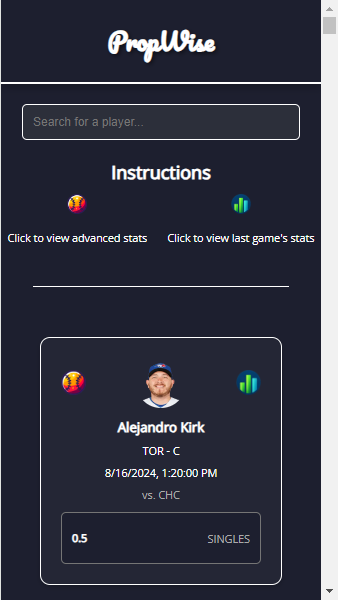

# PropWise

## Description
PropWise is a Chrome extension that provides access to key player statistics for the MLB season. This extension helps users quickly evaluate performance targets using data from PrizePicks and the MLB API.

## Features
- View player statistics for the last game played.
- Search for players and filter results.
- Access advanced player statistics for the season.

## Prerequisites
- Google Chrome browser

## Setup Instructions
1. **Install the Extension:**
   - Download and install the PropWise extension from the Chrome Web Store.

2. **Permissions:**
   - The extension requires access to the following hosts:
     - `https://api.prizepicks.com/*`
     - `https://statsapi.mlb.com/*`

## Usage Instructions
1. **Open the Extension:**
   - Click on the PropWise icon in the Chrome toolbar to open the extension popup.

2. **Search for Players:**
   - Use the search bar to type in the name of the player you are looking for.

3. **View Last Game's Player Statistics:**
   - Click on the last game's stats icon to view detailed player statistics the last game played.

4. **View Advanced Season Stats:**
   - Click on the season stats icon to view detailed player statistics for the season.

## Screenshots

  
## License

This project is licensed under the MIT License. See the [LICENSE](LICENSE) file for more details.

